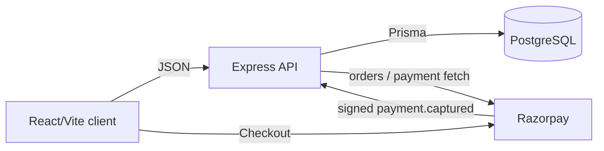

# Bayana Architecture

## System overview

Bayana is an npm-workspace monorepo for wedding-services vendors. A vendor shares a public booking page where a client selects a date, accepts terms, pays a Razorpay advance, and receives a confirmation. The API is authoritative for availability, prices, payments, and state transitions. Its core integrity guarantee is that a vendor cannot have two *confirmed* bookings for one event date.

## Technology stack

| Area | Technology | Evidence |
| --- | --- | --- |
| Runtime | JavaScript ES modules, Node.js | root/server `package.json` |
| Client | React 18, Vite 6, Tailwind CSS | `client/` |
| API | Express 4 REST API | `server/src/app.js` |
| Data | PostgreSQL through Prisma 6 | `server/prisma/schema.prisma` |
| Auth | bcrypt; access and refresh JWTs | `server/src/services/authService.js` |
| Payments | Razorpay Orders, Checkout, webhook | `server/src/services/bookingService.js` |
| Validation | Zod | `server/src/schemas/`, `client/src/schemas/` |
| Logging | Pino/pino-http | `server/src/lib/logger.js` |
| Tests | Vitest; optional PostgreSQL concurrency test | `server/tests/` |

The root uses npm workspaces (`client`, `server`). There is no committed lockfile, CI workflow, Docker configuration, or deployment configuration.

## Repository structure

| Path | Responsibility |
| --- | --- |
| `client/src/main.jsx` | Path selection, public booking flow, Razorpay UI, dashboard shell. |
| `client/src/api/` | Browser fetch wrapper and endpoint calls. |
| `server/src/app.js` | Express composition, CORS, parsers, rate limiting, Swagger, errors. |
| `server/src/routes/` | Route definitions and middleware composition. |
| `server/src/services/` | Authentication, booking/payment, and contract business flows. |
| `server/src/schemas/` | Strict Zod request schemas. |
| `server/src/middleware/` | JWT authentication, ownership, validation, safe errors. |
| `server/prisma/` | Schema, SQL migrations, demo seed. |
| `server/tests/` | Concurrency tests. |
| `docs/LOGIC.md` | Detailed implemented business rules. |
| `docs/swagger.yaml` | Compact OpenAPI inventory. |
| `bayana-project-plan.md` | Historical/planning scope, not implementation status. |

## Runtime and data flow

1. The public client loads a vendor profile and selected-month availability.
2. It posts client details, date, and `acceptContract: true` to create a hold.
3. `createBooking` reads vendor amounts/terms, creates a Razorpay order, then transactionally creates a `pending_payment` booking, `created` payment, and initial history row. Holds expire after 30 minutes.
4. Razorpay Checkout returns proof to the browser. The API validates its HMAC, fetches the payment, and verifies order, amount, INR, and captured status.
5. Confirmation transactionally changes the booking to `confirmed`, creates an immutable contract snapshot, marks payment paid, and appends history. A signed webhook can run this same idempotent path.
6. An in-process startup/minute worker expires stale holds, fails still-created payments, and appends history.

`one_confirmed_booking_per_vendor_date` is a PostgreSQL partial unique index on `(vendor_id, event_date)` for `confirmed` rows. It is the final concurrency guard; service code maps a resulting `P2002` to a safe conflict. Availability checks are advisory.

## Authentication and authorization

Signup hashes a password with bcrypt cost 12; login issues a 15-minute bearer access JWT and a 30-day refresh JWT in an `httpOnly`, `sameSite=lax` cookie. Only SHA-256 refresh-token hashes are persisted; refresh rotates the stored token inside a transaction. `GET /vendors/:vendorId/bookings` requires a bearer token and compares the URL vendor CUID to the JWT subject.

Logout clears the cookie but does not delete the persisted refresh-token hash.

## API, validation, and errors

Implemented routes live under `/api/v1`: auth signup/login/refresh/logout; public vendor profile and availability; booking creation and payment confirmation; authenticated vendor booking list; and Razorpay webhook. `/health` is outside that prefix. Swagger UI is served at `/api/docs` only outside production.

Routes use strict Zod schemas. `AppError` subclasses return `{ error, message }`; Zod failures are 422; `P2002` is 409; unknown errors are logged and return generic 500. The API limits JSON/raw bodies to 32 KB, auth to 10 requests/15 minutes, and public routes to 30/15 minutes. Default rate-limit storage is local to one process.

The Swagger file omits implemented refresh/logout endpoints and provides terse response definitions. Treat routes and schemas as current authority, and update Swagger with API changes.

## Client architecture

The client is a single React entrypoint, without a router library: `/vendor` renders `VendorDashboard`; all other paths render `PublicBooking`. The public UI keeps vendor data, availability, form, payment order, and confirmation in component-local state. Browser Zod checks are UX only; the API validates again. Razorpay Checkout loads from `client/index.html`.

The dashboard is a read-only shell that needs `VITE_VENDOR_ID` and `VITE_VENDOR_TOKEN`; it has no in-app login, onboarding, settings, date blocking, or vendor-specific link management. The public client uses one configured `VITE_PUBLIC_SLUG`, not the project plan's `/book/:vendorSlug` route.

## Database architecture

Prisma maps `vendors`, `blocked_dates`, `bookings`, `payments`, `contracts`, `booking_history`, and `refresh_tokens`. Vendor owns bookings, blocks, history, and refresh tokens; a booking has at most one payment and contract. Money is `NUMERIC(12,0)` / Prisma Decimal (integer paise). Migration triggers make history update/delete operations fail, preserving append-only audit records.

The seed directly creates status records without corresponding payment/history/contract rows; it is demonstration data, not a normal-flow fixture.

## External integrations, testing, and operations

Razorpay is the only implemented third-party integration. `.env.example` defines database, JWT, Razorpay, port, environment, and client-origin values, validated at server startup. Pino redacts authorization, passwords, tokens, and password hashes.

`npm test` runs server Vitest. The modeled concurrency test verifies error translation; the database test runs only with `TEST_DATABASE_URL` against a migrated PostgreSQL database and verifies the partial index. There are no client, HTTP/Supertest, payment-mock, or end-to-end tests, despite Supertest being installed.

No durable scheduler, shared rate-limit store, payment reconciliation process, notification integration, deployment target, or CI/CD configuration is committed. The in-process expiry worker safely rechecks candidates transactionally, but only runs while an API process is running.

## Constraints future agents must preserve

- Keep money as integer paise and calculate amounts from server-side vendor records.
- Keep business logic in services and strictly validate every endpoint input.
- Preserve transaction boundaries around booking creation, confirmation/payment, and expiry.
- Do not weaken the confirmed-date index; translate its conflict to a clean 409.
- Enforce resource ownership on vendor-scoped routes.
- Preserve raw-body parsing and signature verification for the webhook.
- Use centralized safe errors; never log credentials or secrets.
- Keep contracts immutable and history append-only.

## Known architectural gaps

Cancellation/refunds, vendor profile/settings/terms management, blocked-date writes, notifications, durable scheduling, deployment automation, and complete vendor UI are not implemented. The plan mentions them, but code does not establish them as delivered features.
